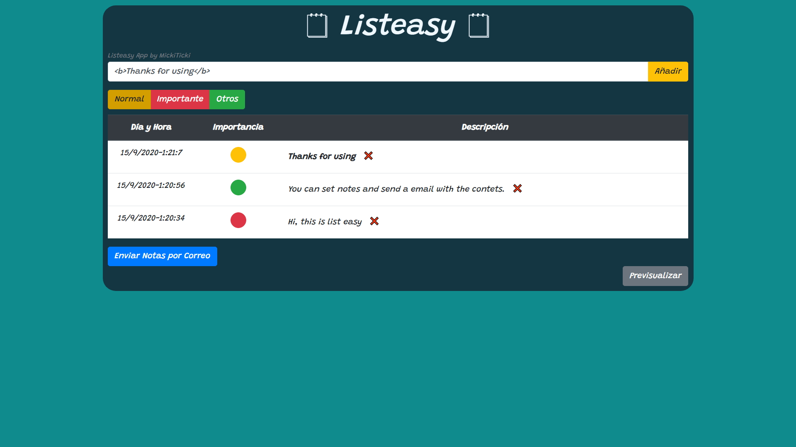

# **🗒 Listeasy 🗒**

## v.0.1

- Maquetación BootsTrap
- Implementación de la notas (Escritura en una tabla)
- Función Colores Javascript (Cambio de Botón)

## v.0.2

- Corrección de Bugs

## v.0.3

- Implantación de Email 
- Optimización de Cógido

## v.0.4 

- Objeto Notas a Email (Falta El Formateo)
- Eliminación de las notas de versión al añadir una nueva nota

## v0.5

- Añadida Ruta de Horizontes 

## v.0.6

- Actualizado el ReadMe.md 

## v.0.7

- Añadida opción de previsualizar el Email
- Añadida cuerpo del email semiformateado

## v.0.8

- DEV:

* * *
- Horizonte Lejano:

  🟥 Animaciones

  🟥 Posiblidad de Ordenar las Notas (Grab and Move)

- Horizonte Cercano:

  🟨 Borrar del Objeto las Notas Eliminadas
 
  🟨 Añadir Emvail para Enviar

  🟨 Añadir Advertencia al Elimnar las Notas

  🟨 Añadir LocalStorage

  🟨 Página 404 - Animación

- Horizonte Alcanzado:

  ✅ Maquetación Bootsrap

  ✅ Selector de Importancia (Color con Cambio Dinámico)

  ✅ Función Ema

  ✅ Opción de Previsualizar el Email

  ✅ Pasar las notas en el cuerpo del email - formateadas (Falta algo de formateo)
* * *

